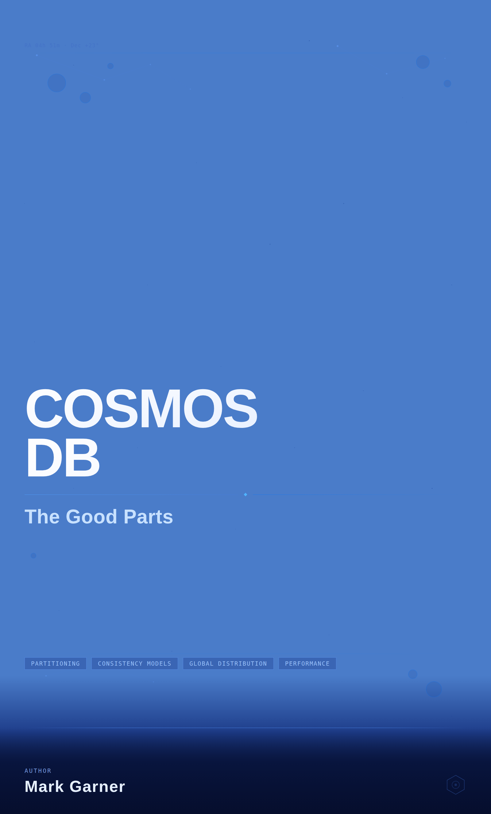

# Cosmos DB: The Good Parts

**NoSQL API Edition** — by Mark Garner

[](https://creativecommons.org/licenses/by-nc-sa/4.0/)



A practical, developer-focused guide to Azure Cosmos DB's NoSQL API. From first principles to production-ready patterns — data modeling, partitioning, querying, global distribution, vector search, and everything in between.

## Download

Grab the latest epub from [**Releases**](../../releases).

## Table of Contents

### Part I: Foundations
1. [What Is Azure Cosmos DB?](manuscript/chapter-01.md)
2. [Core Concepts and Architecture](manuscript/chapter-02.md)
3. [Setting Up Cosmos DB for NoSQL](manuscript/chapter-03.md)

### Part II: Data Modeling and Partitioning
4. [Thinking in Documents](manuscript/chapter-04.md)
5. [Partition Keys — The Most Important Decision You'll Make](manuscript/chapter-05.md)
6. [Advanced Data Modeling Patterns](manuscript/chapter-06.md)

### Part III: SDKs, Querying, and Indexing
7. [Using the Cosmos DB SDKs](manuscript/chapter-07.md)
8. [Querying with the NoSQL API](manuscript/chapter-08.md)
9. [Indexing Policies](manuscript/chapter-09.md)

### Part IV: Throughput, Scaling, and Cost
10. [Request Units In Depth](manuscript/chapter-10.md)
11. [Provisioned Throughput, Autoscale, and Serverless](manuscript/chapter-11.md)

### Part V: Global Distribution and Consistency
12. [Going Global — Multi-Region Distribution](manuscript/chapter-12.md)
13. [Consistency Levels](manuscript/chapter-13.md)

### Part VI: Server-Side Programming and Event-Driven Patterns
14. [Stored Procedures, Triggers, and User-Defined Functions](manuscript/chapter-14.md)
15. [The Change Feed](manuscript/chapter-15.md)
16. [Transactions and Optimistic Concurrency](manuscript/chapter-16.md)

### Part VII: Security, Monitoring, and Operations
17. [Security and Access Control](manuscript/chapter-17.md)
18. [Monitoring, Diagnostics, and Alerting](manuscript/chapter-18.md)
19. [Backup, Restore, and Disaster Recovery](manuscript/chapter-19.md)
20. [CI/CD, DevOps, and Infrastructure as Code](manuscript/chapter-20.md)

### Part VIII: Integration and Ecosystem
21. [Advanced SDK Patterns](manuscript/chapter-21.md)
22. [Integrating with Azure Services](manuscript/chapter-22.md)
23. [Migrating to Cosmos DB](manuscript/chapter-23.md)
24. [Testing Cosmos DB Applications](manuscript/chapter-24.md)

### Part IX: Advanced Topics
25. [Vector Search and AI Applications](manuscript/chapter-25.md)
26. [Multi-Tenancy Patterns](manuscript/chapter-26.md)
27. [Performance Tuning and Best Practices](manuscript/chapter-27.md)
28. [Capstone — Building a Production-Ready Application](manuscript/chapter-28.md)

### Appendices
- [A: Cosmos DB CLI and Terraform Quick Reference](manuscript/appendix-a.md)
- [B: NoSQL Query Language Reference](manuscript/appendix-b.md)
- [C: Consistency Level Comparison Table](manuscript/appendix-c.md)
- [D: Capacity and Pricing Cheat Sheet](manuscript/appendix-d.md)
- [E: Service Limits and Quotas Quick Reference](manuscript/appendix-e.md)

## Building the epub

Requires [Pandoc](https://pandoc.org/installing.html).

```powershell
.\build.ps1
```

## License

This work is licensed under [Creative Commons Attribution-NonCommercial-ShareAlike 4.0 International](https://creativecommons.org/licenses/by-nc-sa/4.0/). You're free to read, share, and adapt — just not for commercial use.
